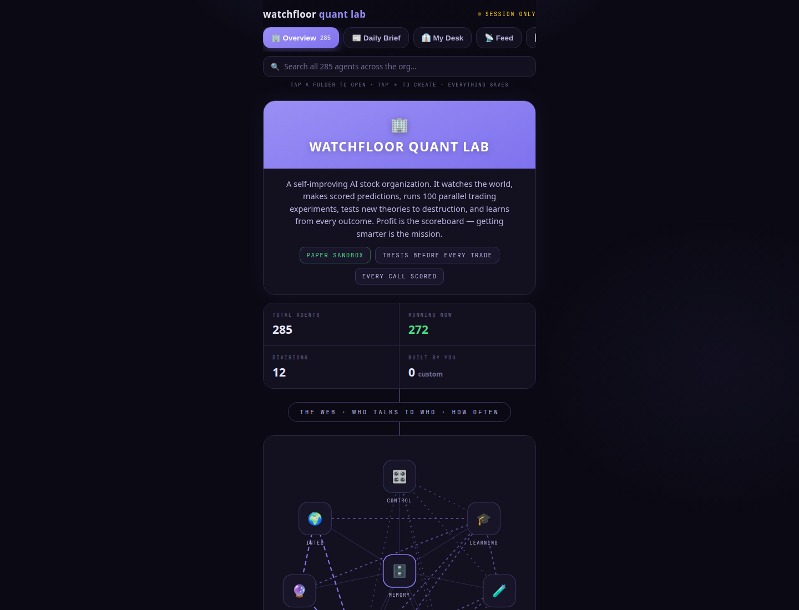
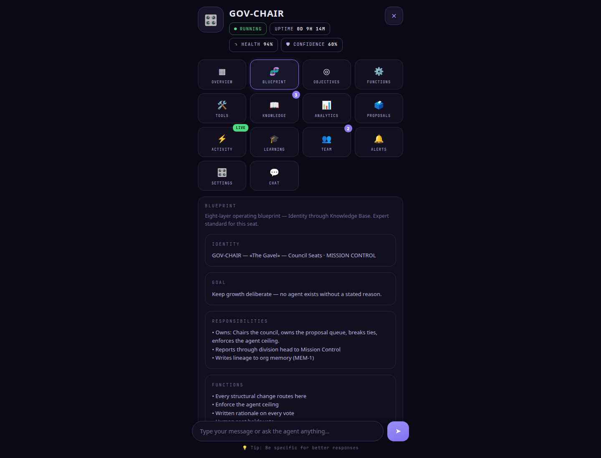
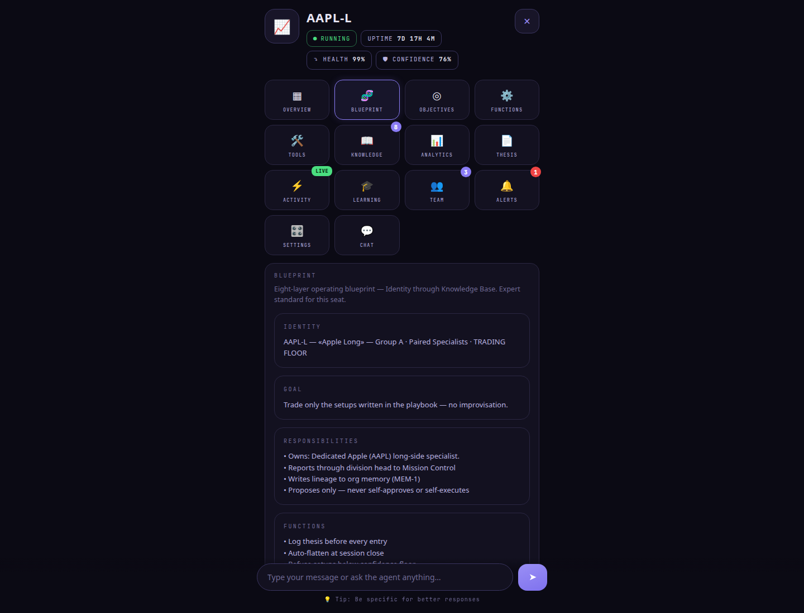
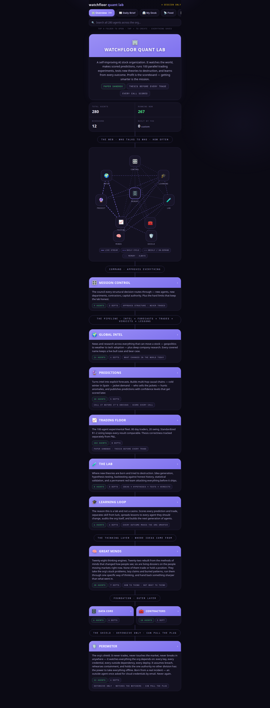
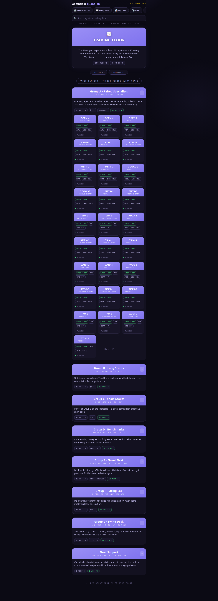
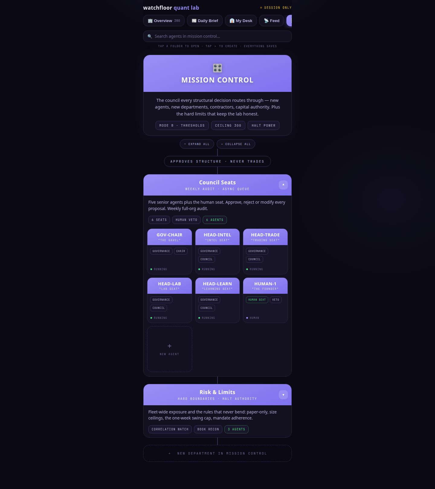
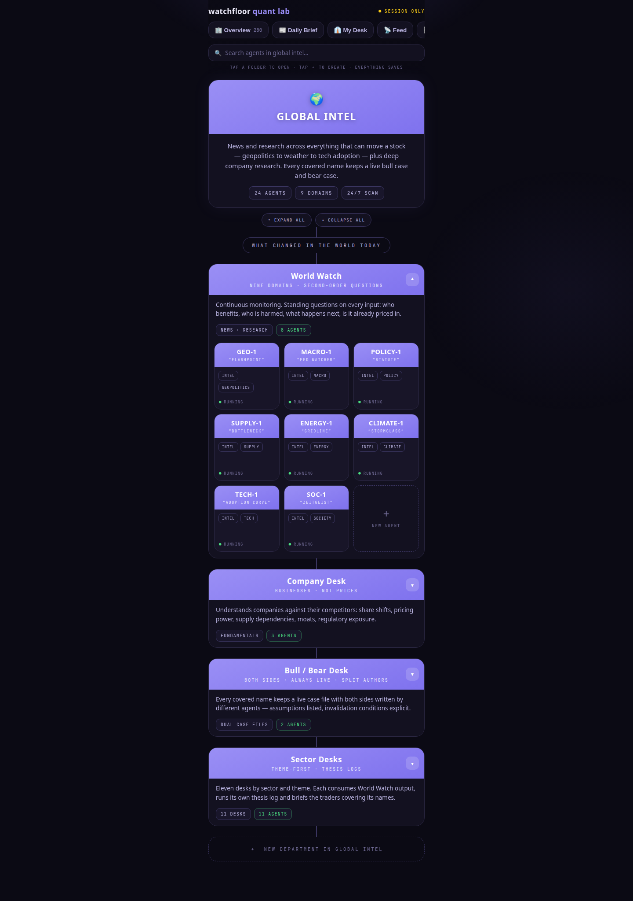
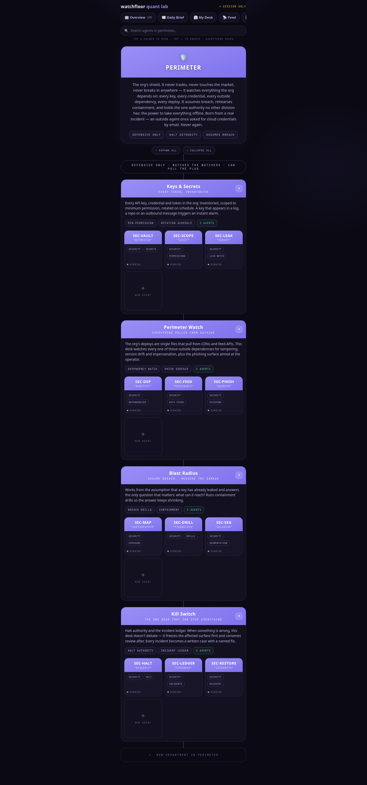

# Watchfloor UI screenshots

Rendered from `ui/watchfloor.html` (registry **v0.5.0 · 285 agents**).

Every agent includes an 8-layer **BLUEPRINT** tile:
Identity · Goal · Responsibilities · Functions · Tools · Capabilities · Memory · Knowledge Base.

